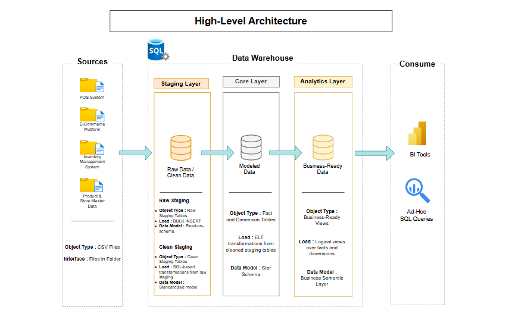
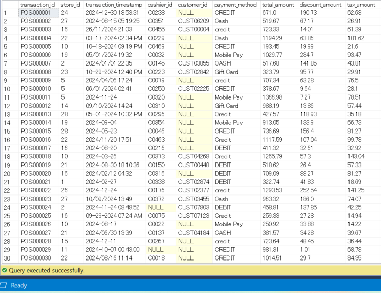
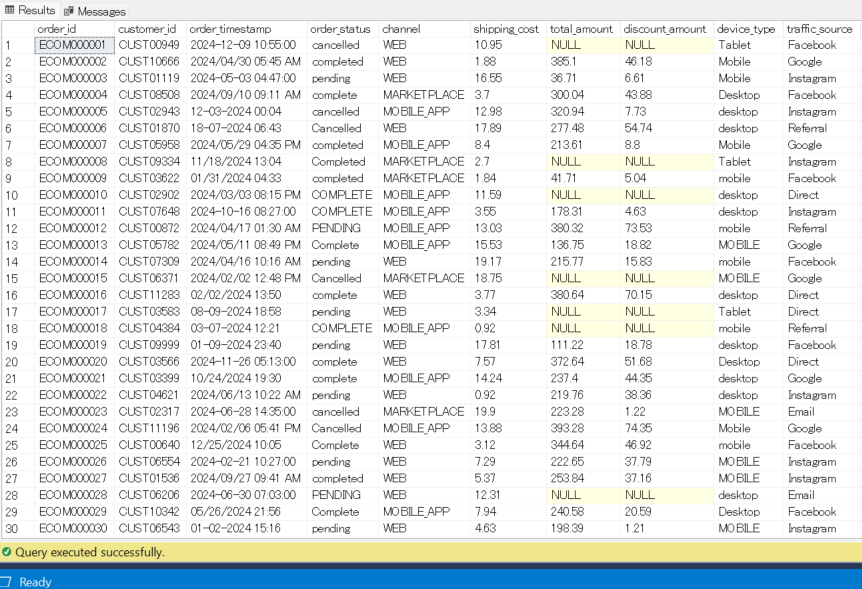
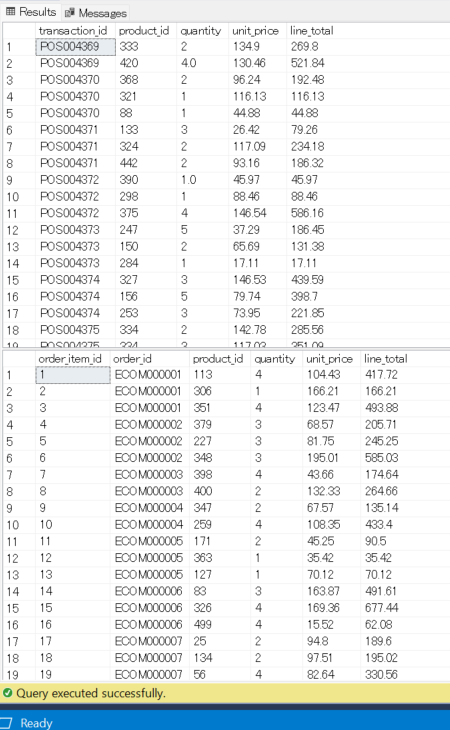
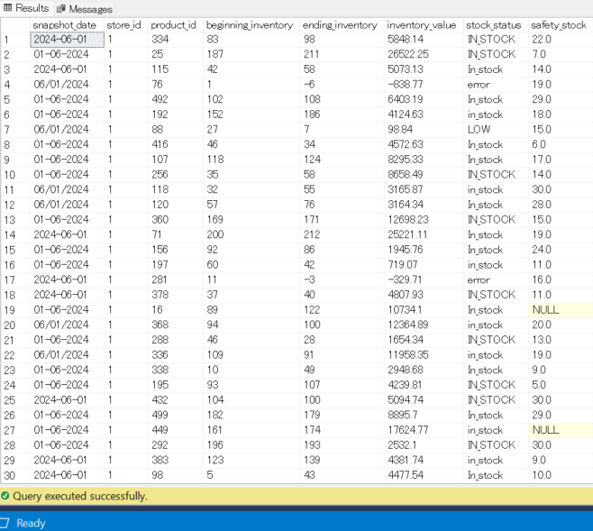
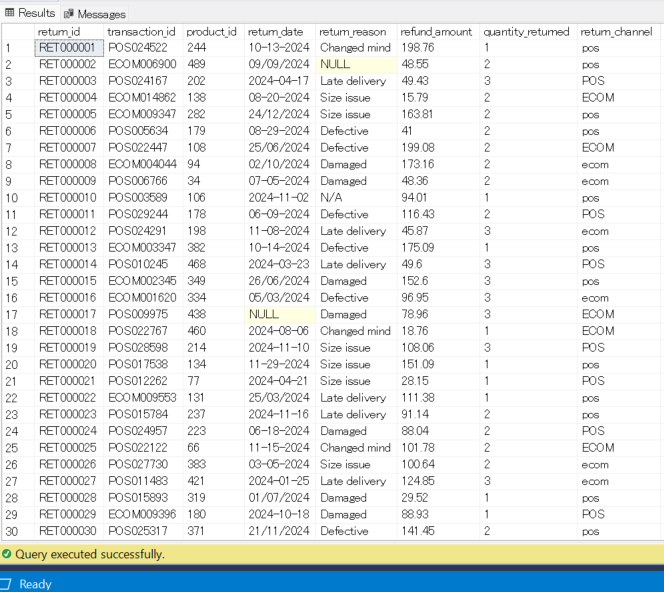
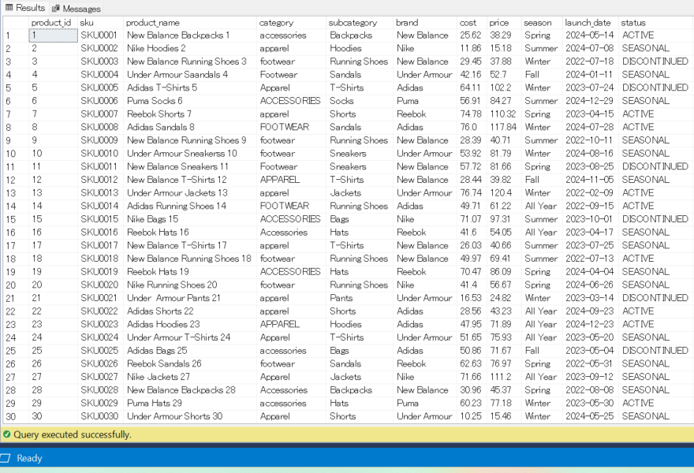
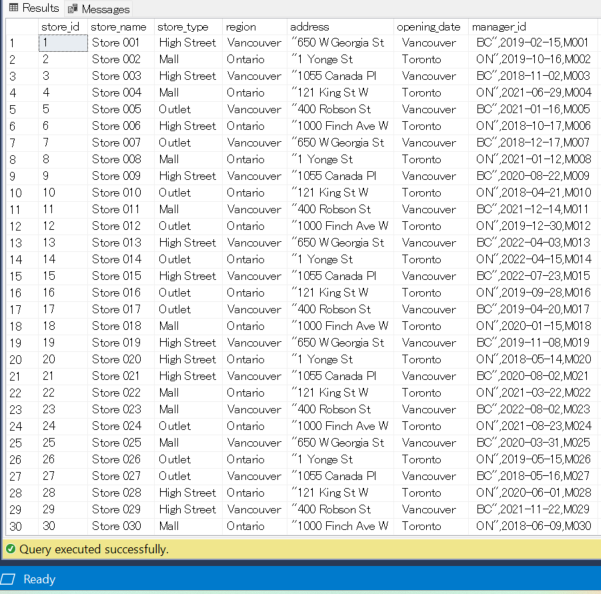

# Retail Analytics BI System  
**End-to-End ELT Data Warehouse for Retail Analytics**

---

## Table of Contents
- [General Info](#general-info)
- [Project Objectives](#project-objectives)
- [Project Description](#project-description)
- [High-Level Architecture](#high-level-architecture)
- [Definition of Key Project Deliverables](#definition-of-key-project-deliverables)
- [Database Schema & Dimensional Model](#database-schema--dimensional-model)
- [Project Processes](#project-processes)
- [Business Impact](#business-impact)
- [Business Impact Summary](#business-impact-summary)
- [Key Skills Demonstrated](#key-skills-demonstrated)

---

## General Info

Retail organizations typically operate across multiple disconnected operational systems, such as in-store POS platforms, e-commerce systems, inventory management tools, and returns processing systems. While these systems generate large volumes of data, they often lack a centralized analytics foundation that enables consistent, reliable reporting.

As a result, analytics teams struggle to answer fundamental business questions around revenue performance, product profitability, inventory efficiency, and return behavior.

This project addresses that gap by designing and implementing a **production-style Retail Analytics Data Warehouse**, applying modern **ELT** and **dimensional modeling** best practices to transform raw operational data into a **trusted, analytics-ready source of truth** for business intelligence and decision-making.

---

## Project Objectives

The objectives of this project are to:

- Design and implement a production-style Retail Analytics Data Warehouse using SQL Server
- Apply a modern ELT architecture (Bronze → Silver → Gold) aligned with analytics engineering best practices
- Perform dimensional data modeling (conformed star schemas) optimized for BI and analytical queries
- Integrate POS, E-commerce, Inventory, Products, Stores, and Returns data into a single source of truth
- Enforce data quality, consistency, and auditability through standardized cleaning and validation logic
- Deliver business-ready analytical views that support executive reporting and operational decision-making
- Enable stakeholders to analyze revenue, profitability, inventory health, and returns at scale

---

## Project Description

A retail organization operates across multiple sales channels, including physical stores (POS) and e-commerce platforms. Each system generates its own datasets for sales, inventory, products, and returns, resulting in fragmented data and inconsistent reporting.

The analytics team lacks a centralized, reliable way to answer core business questions such as:

- How is net revenue trending across channels?
- Which products and categories drive profitability?
- Where are inventory risks and inefficiencies occurring?
- Which products experience high return rates and revenue leakage?

To solve this, a **Retail Analytics BI System** was designed to consolidate raw operational data into a centralized analytics data warehouse. The system loads raw CSV extracts into staging tables, transforms them into clean and standardized datasets, and models them into **conformed star schemas** optimized for BI tools and ad-hoc SQL analysis.

This approach mirrors real-world analytics engineering workflows used by retail, e-commerce, and consumer brands.

---

## High-Level Architecture

**Figure:** End-to-end ELT data warehouse architecture illustrating how raw retail data flows from source systems through layered staging (Bronze/Silver), a conformed dimensional core (Star Schema), and a business semantic layer consumed by BI tools and ad-hoc SQL queries.

### Architecture Overview

The Retail Analytics BI System follows a modern **ELT (Extract, Load, Transform)** architecture designed for scalability, auditability, and analytics performance.

#### Source Systems
- Batch CSV extracts from POS, E-commerce, Inventory Management, and Product & Store Master Data systems

#### Staging Layer (Bronze & Silver)
- **Bronze:** Raw staging tables preserve source data exactly as received (schema-on-read)
- **Silver:** Clean staging tables standardize data types, normalize business fields, apply data quality checks, and flag duplicates without data loss

#### Core Layer (Conformed Star Schema)
- Fact and dimension tables provide a single source of truth, enforce clear grains, and support high-performance analytical queries

#### Analytics Layer (Semantic / Gold)
- Business-ready SQL views encapsulate joins and KPI logic, enabling consistent metrics and efficient BI queries

#### Consumption Layer
- Power BI dashboards, Tableau reports, and ad-hoc SQL analysis consume analytics views directly without reimplementing business logic

This layered design mirrors production analytics architectures used by retail and e-commerce organizations, ensuring insights are reliable, explainable, and scalable.

---

## Definition of Key Project Deliverables

### Datasets

The project integrates data extracted from multiple operational systems. All source data is ingested as CSV files into the **Bronze (raw staging) layer**.

Primary datasets include:

- `pos_transactions_raw`
- `pos_items_raw`
- `ecom_orders_raw`
- `ecom_items_raw`
- `inventory_snapshots_raw`
- `returns_raw`
- `products_raw`
- `stores_raw`

---

### 1️. POS Transactions Dataset

- **Grain:** One row per in-store transaction  
- **Purpose:** Capture in-store revenue, payment methods, discounts, and taxes  

**Key attributes**
- Transaction ID
- Store ID
- Transaction timestamp
- Payment method
- Total, discount, tax, and net revenue

**Business value**
- Enables store-level revenue analysis
- Supports AOV and transaction-based KPIs

---

### 2️. E-Commerce Orders Dataset

- **Grain:** One row per e-commerce order  
- **Purpose:** Capture online order revenue and digital attributes  

**Key attributes**
- Order ID
- Order timestamp
- Channel (Web / App)
- Device type
- Traffic source
- Discounts, shipping, and net revenue

**Business value**
- Enables digital channel performance analysis
- Supports marketing and attribution insights

---

### 3️. Sales Line Items Dataset (Unified – POS + E-Commerce)

- **Grain:** One row per product per transaction  
- **Purpose:** Unified view of all product-level sales activity  

This dataset is derived by unifying POS and e-commerce line items during the transformation process, rather than existing as a single raw source.

**Key attributes**
- Product ID
- Quantity sold
- Unit price
- Line revenue
- Source system (POS / ECOM)

**Business value**
- Supports product and category performance analysis
- Enables margin and product-mix optimization

---

### 4️. Inventory Snapshots Dataset

- **Grain:** One row per product per store per date  
- **Purpose:** Point-in-time inventory tracking  

**Key attributes**
- Beginning and ending inventory
- Inventory value
- Safety stock
- Stock status

**Business value**
- Identifies stock-out risk and inventory imbalances
- Supports inventory turnover and capital efficiency analysis

---

### 5️. Returns Dataset

- **Grain:** One row per return event  
- **Purpose:** Track refunds and customer dissatisfaction signals  

**Key attributes**
- Return quantity
- Refund amount
- Return reason
- Return channel

**Business value**
- Enables return rate and refund impact analysis
- Identifies product quality and customer experience issues

---

### Product & Store Master Data (Reference Data)

The `products_raw` and `stores_raw` datasets represent **master data**
used to enrich transactional and operational facts.

These datasets do not generate KPIs directly, but provide the descriptive
context required for product-, store-, and region-level analysis.

They are transformed into conformed dimensions and reused across all
analytical domains.

---

## Database Schema & Dimensional Model

The data warehouse is designed using **multiple subject-area star schemas with conformed dimensions**, rather than a single monolithic model. Each star schema is optimized around a specific analytical use case, improving usability, performance, and clarity for BI consumers.

This design mirrors how production retail analytics warehouses support diverse stakeholder needs while maintaining metric consistency.

---

### Star Schema Overview (By Business Domain)

#### 1️. In-Store Sales Star Schema (POS)

**Fact Table**
- `fact_pos_transactions` — In-store transaction-level revenue and payment data

**Dimensions**
- `dim_date` — Calendar and time attributes
- `dim_store` — Store metadata and regional hierarchy

**Primary Use Cases**
- Store-level revenue and AOV analysis
- Payment method mix analysis
- Regional performance comparisons

---

### 2. E-Commerce Orders Star Schema

**Fact Table**
- `fact_ecom_orders` — Online order-level revenue and digital attributes

**Dimensions**
- `dim_date` — Order date and time attributes

**Primary Use Cases**
- Online revenue trend analysis
- Channel, device, and traffic source performance
- Digital AOV and order volume tracking

---

#### 3️. Sales Line Items Star Schema (POS + E-Commerce)

***Fact Table**
- `fact_sales_items` — Unified product-level sales across all channels

**Dimensions**
- `dim_product` — Product attributes, pricing, and margins
- `dim_date` — Transaction date
- `dim_store` — Store context (where applicable)

**Primary Use Cases**
- Product and category performance analysis
- Margin and product-mix optimization
- Cross-channel sales comparisons

---

### 4️. Inventory Star Schema

**Fact Table**
- `fact_inventory_snapshots` — Point-in-time inventory levels by product and store

**Dimensions**
- `dim_product` — Product master data
- `dim_store` — Store and location attributes
- `dim_date` — Inventory snapshot date

**Primary Use Cases**
- Stock-out and overstock detection
- Inventory turnover analysis
- Capital efficiency and safety stock monitoring

---

### 5️. Returns Star Schema

**Fact Table**
- `fact_returns` — Product return events and refund amounts

**Dimensions**
- `dim_product` — Returned product details
- `dim_store` — Return location (when applicable)
- `dim_date` — Return date

**Primary Use Cases**
- Return rate and refund impact analysis
- Identification of high-return products
- Customer experience and quality issue detection

---

### Conformed Dimensions

All star schemas share a set of conformed dimensions, ensuring metric consistency across dashboards and analyses:

- `dim_date` — Standardized calendar attributes
- `dim_product` — Centralized product master data
- `dim_store` — Unified store and regional hierarchy

---

### Why Multiple Star Schemas?

- Improved usability: Each schema aligns directly with a business question
- Simpler BI queries: Analysts avoid unnecessary joins and ambiguity
- Clear grain definition: Prevents metric distortion and double counting
- Performance optimization: Faster aggregations for dashboards
- Production-grade design: Commonly used in enterprise retail analytics platforms

---

## Project Processes

### 1️. Database & Schema Setup
- Create database and schemas (`staging`, `core`, `analytics`)
- Define raw staging tables (Bronze)
- Define cleaned staging tables (Silver)
- Define dimension and fact tables (Gold)
- Apply primary keys, foreign keys, and unique constraints

---

### 2️. ELT Pipeline (SQL-Based)

**Extract (External)**
- Operational systems export batch CSV files
  
**Load**
- Load CSV files into raw staging tables using `BULK INSERT`
- Preserve raw data exactly as received
- Capture ingestion metadata for auditability

**Transform**
- Standardize data using `TRY_CONVERT`
- Normalize categorical fields
- Recalculate and reconcile financial metrics
- Flag data quality issues instead of dropping records
- Deduplicate deterministically using window functions  

---

### 3️. Analytics Layer
- Build BI-ready SQL views that abstract complex joins
- Define consistent business logic for KPIs
- Design read-optimized views for BI and analytical workloads

---

## Business Impact

This warehouse is designed to **drive decisions, not just store data**.

### Executive & Finance Teams
- Track net revenue trends across POS and E-commerce
- Understand channel mix shifts and growth drivers
- Monitor AOV, unit volume, and contribution margin
- Support forecasting, budgeting, and performance reviews

### Merchandising & Product Teams
- Identify top and bottom-performing products
- Evaluate product-level margins and pricing effectiveness
- Optimize category and assortment mix
- Detect products with high return rates or negative margins

### Inventory & Operations
- Monitor inventory levels over time and safety stock breaches
- Identify slow-moving or overstocked products
- Improve inventory turnover and capital efficiency
- Align stock availability with sales demand

### Retail & E-Commerce Teams
- Compare in-store vs online performance
- Analyze device and traffic source behavior
- Understand returns by channel and reason
- Reduce revenue leakage and customer friction

---

## Business Impact Summary

This system enables the organization to:

- Trust revenue and profitability metrics
- Identify growth drivers and operational risks
- Improve inventory efficiency and cash flow
- Reduce return-related revenue leakage
- Empower analysts with self-service, analytics-ready data

---

## Key Skills Demonstrated

- ELT data warehouse design (Bronze / Silver / Gold)
- SQL-based data ingestion using `BULK INSERT`
- Data cleaning, standardization, and validation
- Dimensional modeling with conformed star schemas
- Fact and dimension table design
- Data quality flagging and deterministic deduplication
- KPI and semantic layer design using SQL views
- BI-ready data modeling for Power BI and Tableau
- Analytics engineering best practices

---
