# Retail Analytics BI System  
**End-to-End ELT Data Warehouse for Retail Analytics**

---

## Table of Contents
- [General Info](#general-info)
- [Project Objectives](#project-objectives)
- [Project Description](#project-description)
- [High-Level Architecture](#high-level-architecture)
- [Data Flow & Lineage](#data-flow--lineage)
- [Repository Structure](#repository-structure)
- [Execution Flow (ELT Pipeline)](#execution-flow-elt-pipeline)
- [Modeled Data Sample (Gold Layer)](#modeled-data-sample-gold-layer)
- [Definition of Source Data](#definition-of-source-data)
- [Database Schema & Dimensional Model](#database-schema--dimensional-model)
- [Project Processes](#project-processes)
- [Sample KPI Outputs](#sample-kpi-outputs)
- [Business Impact](#business-impact)
- [Business Impact Summary](#business-impact-summary)

---

## General Info

Retail companies typically operate across multiple disconnected operational systems, such as in-store POS systems, e-commerce platforms, inventory management tools, and returns processing systems. While these systems generate large amounts of data, they often lack a centralized analytics system that enables consistent, reliable reporting.

As a result, analytics teams struggle to answer fundamental business questions around revenue performance, product profitability, inventory efficiency, and return behavior.

This project addresses that gap by designing, building, and deploying a **production-style Retail Analytics Data Warehouse**, applying modern **ELT** and **dimensional modeling** best practices to transform raw operational data into a **reliable, analytics-ready source of truth** for business intelligence and executive decision-making.

---

## Project Objectives

The objectives of this project are to:

- Design, build, and deploy a production-style retail analytics data warehouse using SQL Server
- Apply a modern ELT architecture (Bronze → Silver → Gold), aligned with analytics engineering best practices
- Perform dimensional data modeling using conformed star schemas optimized for BI tools and ad-hoc SQL analysis
- Integrate POS, e-commerce, inventory, product, store, and returns data into a unified single source of truth
- Ensure data quality, auditability, and traceability through standardized validation and cleaning processes
- Deliver business-ready analytical views to support executive reporting and operational decision-making
- Enable stakeholders to analyze revenue, profitability, inventory health, and returns at scale

---

## Project Description

A retail company operates across multiple sales channels, including physical stores and e-commerce platforms. Each system generates its own datasets for sales, inventory, products, and returns, resulting in fragmented data and inconsistent reporting.

The analytics team lacks a centralized, reliable way to answer core business questions such as:

- How is net revenue trending across channels?
- Which products and categories drive profitability?
- Where are inventory risks and inefficiencies occurring?
- Which products experience high return rates and revenue leakage?

To solve this, a **Retail Analytics BI System** was designed to consolidate raw operational data into a centralized data warehouse. The system loads raw CSV extracts into staging tables, transforms them into clean and standardized datasets, and models them into **conformed star schemas** optimized for BI tools and ad-hoc SQL analysis.

---

## High-Level Architecture

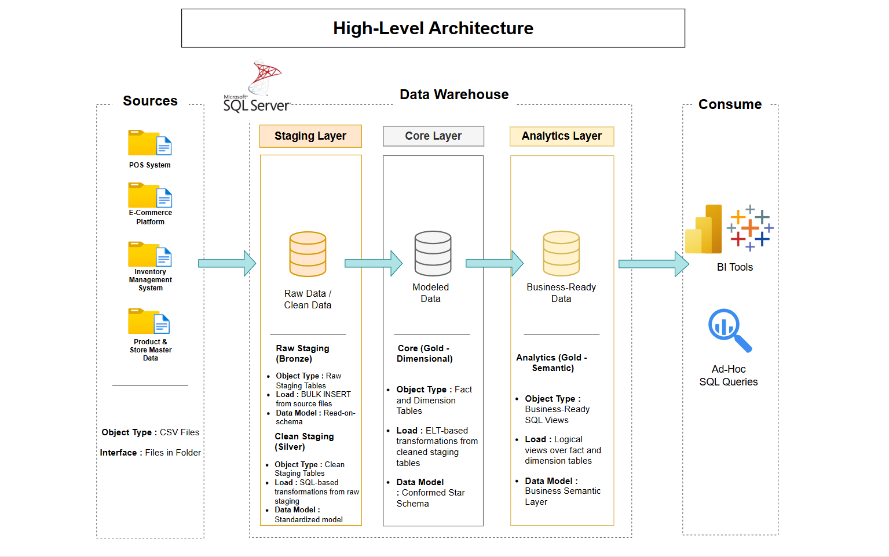

**Figure:** End-to-end ELT data warehouse architecture depicting the flow of raw retail data from source systems through Bronze and Silver staging layers, a conformed Gold-layer star schema, and a semantic layer supporting BI tools and ad-hoc analysis.

### Architecture Overview

The Retail Analytics BI System follows a modern **ELT (Extract, Load, Transform)** architecture designed for scalability, auditability, traceability, and analytics performance.

#### Source Systems
- Batch CSV extracts from POS systems, e-commerce platforms, inventory management tools, and product and store master data sources

#### Staging Layer (Bronze & Silver)
- **Bronze:** Raw staging tables preserve source data exactly as received, supporting schema-on-read ingestion
- **Silver:** Clean staging tables standardize data types, normalize business fields, apply data quality checks, and flag duplicates without data loss

#### Core Layer (Conformed Star Schema)
- Fact and dimension tables establish a single source of truth, enforce well-defined grains, and support high-performance analytical queries

#### Analytics Layer (Semantic / Gold)
- Business-ready SQL views encapsulate business logic, enabling consistent metric definitions and efficient ad-hoc SQL analysis

#### Consumption Layer
- Power BI dashboards, Tableau dashboards, and ad-hoc SQL queries consume conformed star schemas or semantic views directly, without reimplementing business logic

---

## Data Flow & Lineage

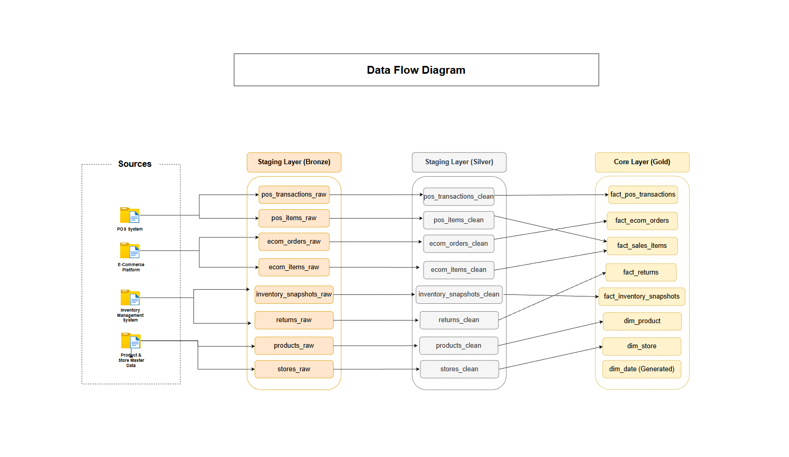

**Figure:** Table-level data lineage showing how raw source datasets are ingested
into staging tables (Bronze), standardized in clean staging (Silver), and
transformed into conformed fact and dimension tables in the Core layer.

> **Note:** The `dim_date` table is a generated conformed dimension and does not
> originate from operational source systems. It is created independently and
> reused across all fact tables.

---

## Repository Structure
```
retail-analytics-bi-system/
│
├── analytics/                          # Business-facing analytics & semantic layer
│   ├── README.md
│   ├── business_questions.md
│   ├── data_catalog.md
│   ├── metrics_definitions.md
│   └── sample_queries.sql
│
├── dashboards/                         # BI dashboards and documentation
│   └── README.md
│
├── diagrams/                           # Architecture, lineage, and schema diagrams
│   ├── updated_architecture.png
│   ├── data_flow_diagram.png
│   ├── ecommerce_star_schema.png
│   ├── instore_star_schema.png
│   ├── inventory_star_schema.png
│   ├── returns_star_schema.png
│   └── sales_line_items_star_schema.png
│
├── images/                             # Screenshots used in documentation
│   ├── kpi_samples/
│   ├── modeled_data_samples/
│   └── raw_data_samples/
│
├── raw_data/                           # Raw source datasets (CSV extracts)
│   ├── ecom_orders_raw.csv
│   ├── ecom_order_items_raw.csv
│   ├── pos_transactions_raw.csv
│   ├── pos_order_items_raw.csv
│   ├── inventory_raw.csv
│   ├── products_raw.csv
│   ├── stores_raw.csv
│   └── returns_raw.csv
│
├── samples/                            # Lightweight, shareable data samples
│   ├── kpi_samples_csv/
│   └── modeled_data_samples_csv/
│
├── sql_scripts/                        # SQL-based ELT pipeline
│   ├── README.md
│   ├── 00_database_and_schemas.sql
│   ├── 01_staging_raw_tables.sql
│   ├── 02_bulk_ingestion.sql
│   ├── 03_data_validation.sql
│   ├── 04_staging_cleaning.sql
│   ├── 05_dimension_tables.sql
│   ├── 06_fact_tables.sql
│   ├── 07_constraints_and_indexes.sql
│   └── 08_analytics_views.sql
│
├── tests/                              # Data quality and integrity checks
│   ├── staging_quality_checks.sql
│   └── core_quality_checks.sql
│
├── LICENSE
└── README.md
```

---

## Execution Flow (ELT Pipeline)

This project implements a SQL-based ELT pipeline following a Bronze → Silver → Gold architecture.

The pipeline is executed in the following order:

1. **Database and schema setup**
   - `00_database_and_schemas.sql`

2. **Raw data ingestion (Bronze layer)**
   - `01_staging_raw_tables.sql`
   - `02_bulk_ingestion.sql`

3. **Initial data validation**
   - `03_data_validation.sql`

4. **Data cleaning and standardization (Silver layer)**
   - `04_staging_cleaning.sql`

5. **Dimensional modeling (Gold layer)**
   - `05_dimension_tables.sql`
   - `06_fact_tables.sql`

6. **Constraints, keys, and performance optimization**
   - `07_constraints_and_indexes.sql`

7. **Analytics and semantic layer**
   - `08_analytics_views.sql`

Detailed execution instructions and script descriptions are available in:
`sql_scripts/README.md`

**Expected outputs:**
- Populated fact and dimension tables
- Analytics-ready views aligned with defined KPIs
- Data quality checks applied to core entities

---

### Modeled Data Sample (Gold Layer)

Example output from the `fact_sales_items` table after ELT processing:

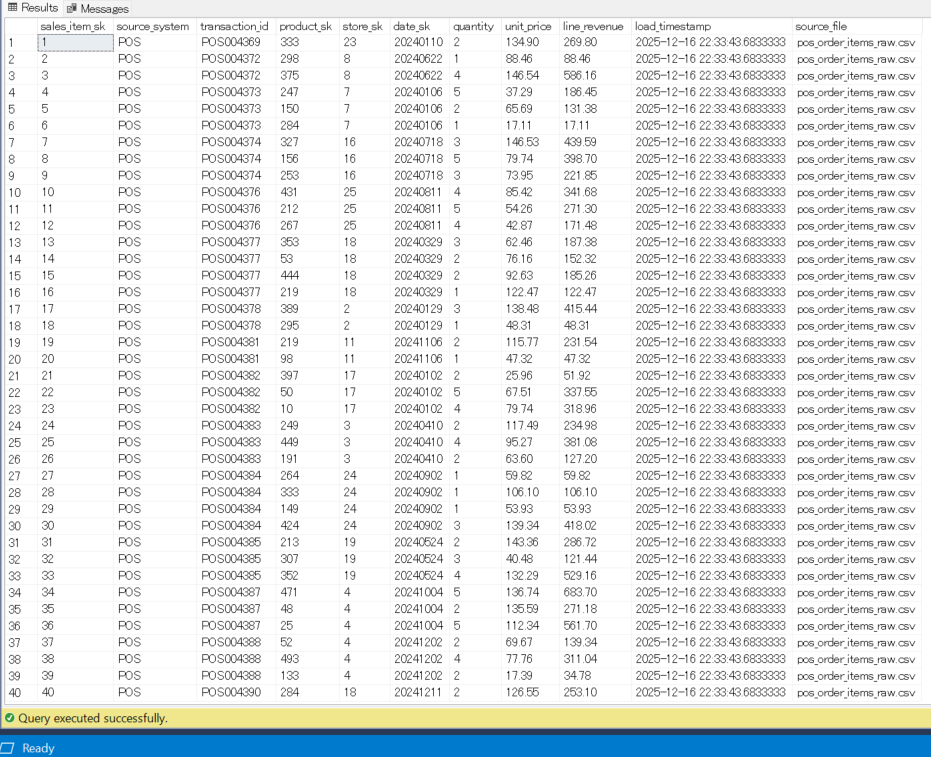

Full data samples are available in:
`samples/`

---

## Definition of Source Data

### Datasets

The project integrates data extracted from multiple operational systems. All source data is ingested as CSV files into the Bronze layer (raw staging schema).

Primary datasets include:

- `pos_transactions_raw`
- `pos_items_raw`
- `ecom_orders_raw`
- `ecom_items_raw`
- `inventory_snapshots_raw`
- `returns_raw`
- `products_raw`
- `stores_raw`

---

### 1️. POS Transactions Dataset

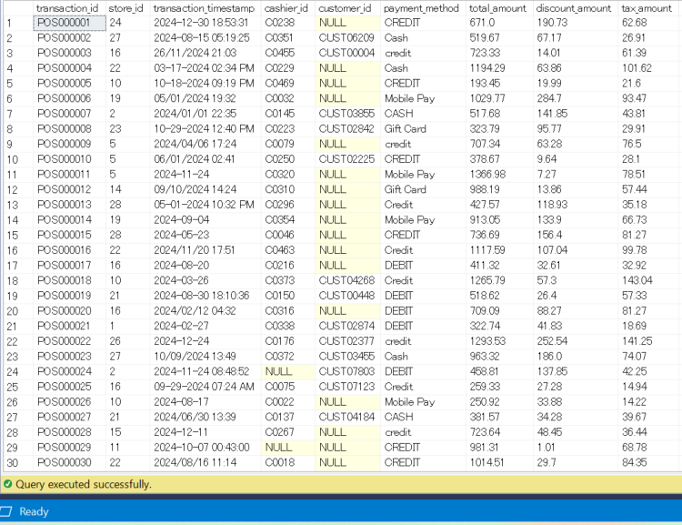

- **Grain:** One row per in-store transaction  
- **Purpose:** Capture in-store revenue, payment methods, discounts, and taxes  

**Key attributes**
- Transaction ID
- Store ID
- Transaction timestamp
- Payment method
- Total, discount, tax, and net revenue

**Business value**
- Enables store-level revenue analysis
- Supports AOV and transaction-based KPIs

---

### 2️. E-Commerce Orders Dataset

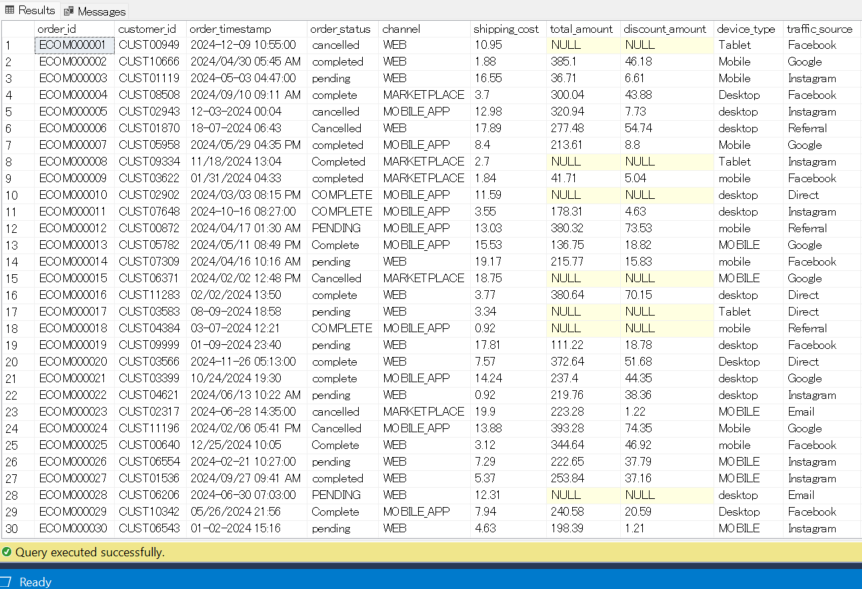

- **Grain:** One row per e-commerce order  
- **Purpose:** Capture online order revenue and digital attributes  

**Key attributes**
- Order ID
- Order timestamp
- Channel (Web / App)
- Device type
- Traffic source
- Discounts, shipping, and net revenue

**Business value**
- Enables digital channel performance analysis
- Supports marketing and attribution insights

---

### 3️. Sales Line Items Dataset (Unified – In-Store + E-Commerce)

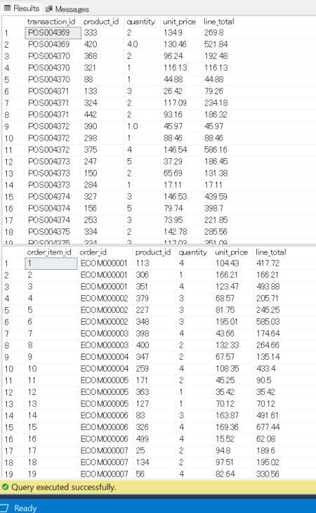

- **Grain:** One row per product per transaction  
- **Purpose:** Unified view of all product-level sales activity  

This dataset is derived by unifying in-store and e-commerce line items during the transformation process, rather than existing as a single raw source.

**Key attributes**
- Product ID
- Quantity sold
- Unit price
- Line revenue
- Source system (POS / ECOM)

**Business value**
- Supports product and category performance analysis
- Enables margin and product-mix optimization

---

### 4️. Inventory Snapshots Dataset

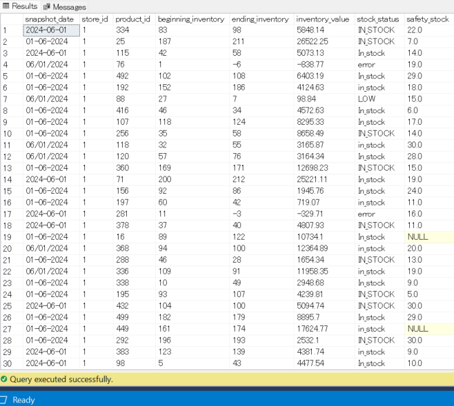

- **Grain:** One row per product per store per date  
- **Purpose:** Point-in-time inventory tracking  

**Key attributes**
- Beginning and ending inventory
- Inventory value
- Safety stock
- Stock status

**Business value**
- Identifies stock-out risk and inventory imbalances
- Supports inventory turnover and capital efficiency analysis

---

### 5️. Returns Dataset

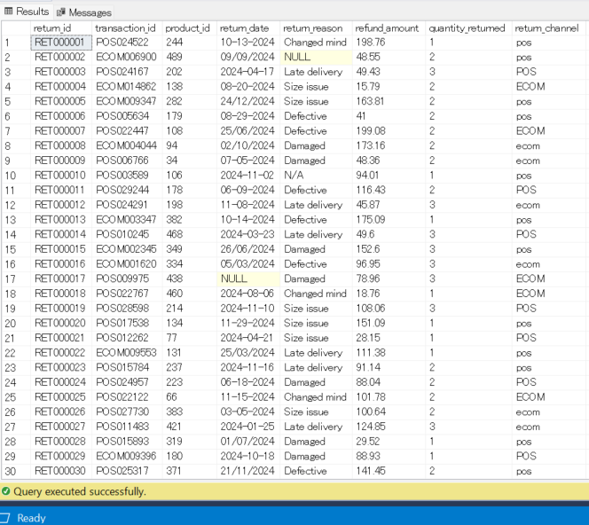

- **Grain:** One row per return event  
- **Purpose:** Track refunds and customer dissatisfaction signals  

**Key attributes**
- Return quantity
- Refund amount
- Return reason
- Return channel

**Business value**
- Enables return rate and refund impact analysis
- Identifies product quality and customer experience issues

---

### Product & Store Master Data (Reference Data)

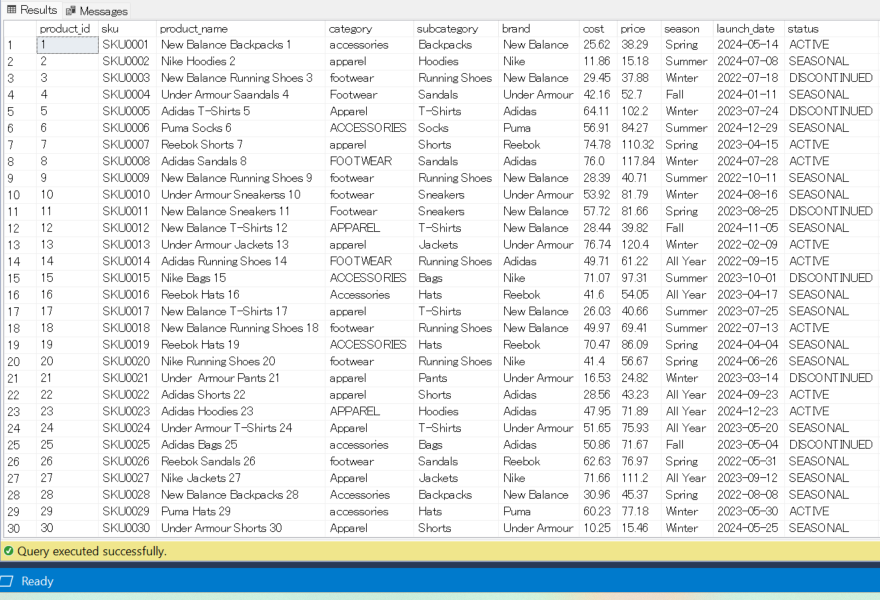

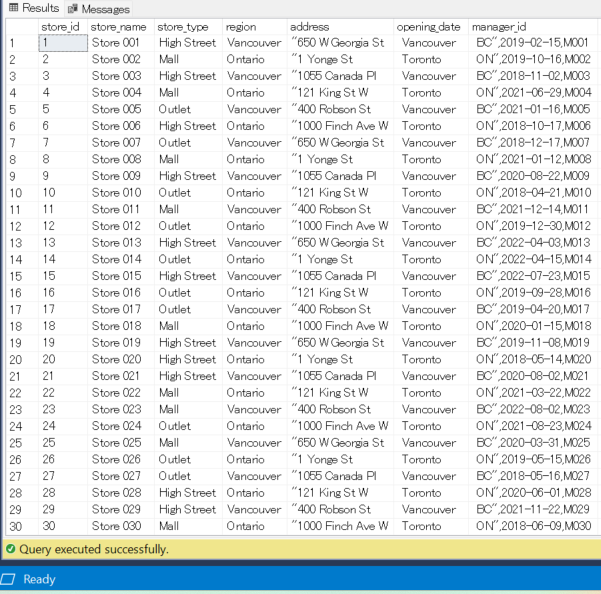

The `products_raw` and `stores_raw` datasets represent **master data**
used to enrich transactional and operational facts.

These datasets do not generate KPIs directly, but provide the descriptive
context required for product-, store-, and region-level analysis.

They are transformed into conformed dimensions and reused across all
analytical domains.

---

## Database Schema & Dimensional Model

The data warehouse is designed using **multiple subject-area star schemas with conformed dimensions**, rather than a single monolithic model. Each star schema is optimized around a specific analytical use case, improving usability, clarity, and performance for BI users.

---

### Star Schema Overview (By Business Domain)

#### 1️. In-Store Sales Star Schema (POS)

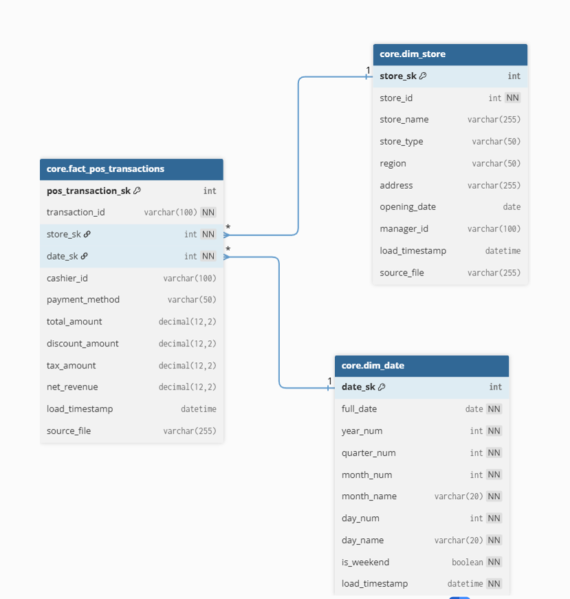

**Fact Table**
- `fact_pos_transactions` — In-store transaction-level revenue and payment data

**Dimensions**
- `dim_date` — Calendar and time attributes
- `dim_store` — Store metadata and regional hierarchy

**Primary Use Cases**
- Store-level revenue and AOV analysis
- Payment method mix analysis
- Regional performance comparisons

---

#### 2. E-Commerce Orders Star Schema

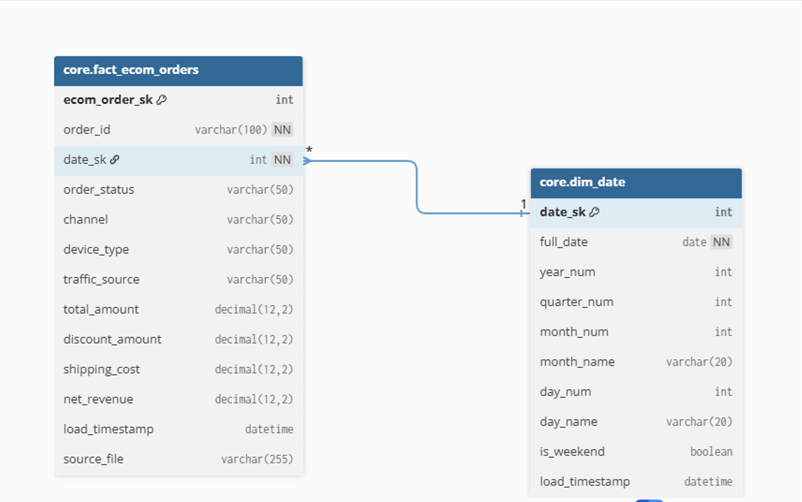

**Fact Table**
- `fact_ecom_orders` — Online order-level revenue and digital attributes

**Dimensions**
- `dim_date` — Order date and time attributes

**Primary Use Cases**
- Online revenue trend analysis
- Channel, device, and traffic source performance
- Digital AOV and order volume tracking

---

#### 3️. Sales Line Items Star Schema (POS + E-Commerce)

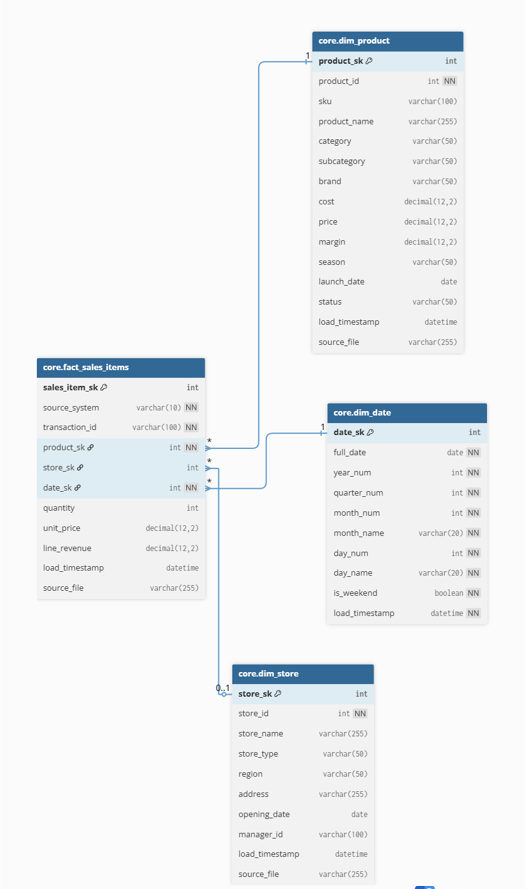

**Fact Table**
- `fact_sales_items` — Unified product-level sales across all channels

**Dimensions**
- `dim_product` — Product attributes, pricing, and margins
- `dim_date` — Transaction date
- `dim_store` — Store context (where applicable)

**Primary Use Cases**
- Product and category performance analysis
- Margin and product-mix optimization
- Cross-channel sales comparisons

---

#### 4️. Inventory Star Schema

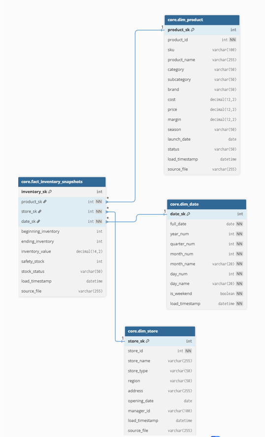

**Fact Table**
- `fact_inventory_snapshots` — Point-in-time inventory levels by product and store

**Dimensions**
- `dim_product` — Product master data
- `dim_store` — Store and location attributes
- `dim_date` — Inventory snapshot date

**Primary Use Cases**
- Stock-out and overstock detection
- Inventory turnover analysis
- Capital efficiency and safety stock monitoring

---

#### 5️. Returns Star Schema

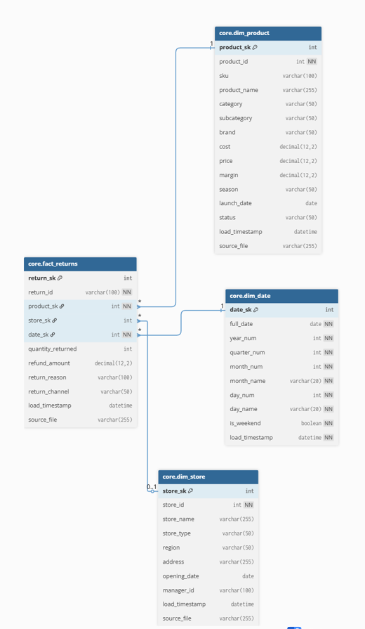

**Fact Table**
- `fact_returns` — Product return events and refund amounts

**Dimensions**
- `dim_product` — Returned product details
- `dim_store` — Return location (when applicable)
- `dim_date` — Return date

**Primary Use Cases**
- Return rate and refund impact analysis
- Identification of high-return products
- Customer experience and quality issue detection

---

#### Conformed Dimensions

All star schemas share a set of conformed dimensions, ensuring metric consistency across dashboards and analyses:

- `dim_date` — Standardized calendar attributes
- `dim_product` — Centralized product master data
- `dim_store` — Unified store and regional hierarchy

---

### Why Multiple Star Schemas?

- Improved usability: Each schema aligns directly with a business question
- Simpler BI queries: Analysts avoid unnecessary joins and ambiguity
- Clear grain definition: Prevents metric distortion and double counting
- Performance optimization: Faster aggregations for dashboards
- Production-grade design: Commonly used in enterprise retail analytics platforms

---

## Project Processes

### 1. Database & Schema Setup
- Create the database and schemas (`staging`, `core`, `analytics`)
- Define raw staging tables (Bronze)
- Define cleaned staging tables (Silver)
- Define dimension and fact tables (Gold)
- Apply primary keys, foreign keys, and unique constraints

---

### 2. ELT Pipeline (SQL-Based)

**Extract (External)**
- Operational systems export batch CSV files

**Load**
- Load CSV files into raw staging tables using `BULK INSERT`
- Preserve source data exactly as received
- Capture ingestion metadata to support auditability

**Transform**
- Standardize data types using `TRY_CONVERT`
- Normalize categorical business fields
- Recalculate and reconcile financial metrics
- Flag data quality issues instead of dropping records
- Deduplicate records deterministically using window functions

---

### 3. Analytics Layer
- Build BI-ready SQL views that abstract complex joins
- Define consistent business logic for KPI calculations
- Design read-optimized views for BI tools and analytical workloads

---

### Sample KPI Output

The following example shows a KPI query executed against the analytics layer:

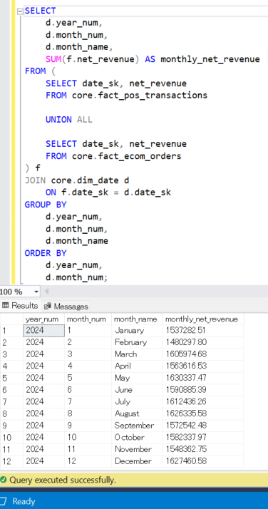

Additional KPI samples are available in:
`samples/kpis/`

---

## Business Impact

This warehouse is designed to **support decision-making, not just data storage**.

### Executive & Finance Teams
- Track net revenue trends across POS and e-commerce channels
- Understand channel mix shifts and key growth drivers
- Monitor average order value (AOV), unit volume, and contribution margin
- Support forecasting, budgeting, and performance reviews

### Merchandising & Product Teams
- Identify top- and bottom-performing products
- Evaluate product-level margins and pricing effectiveness
- Optimize category and assortment mix
- Detect products with high return rates or negative margins

### Inventory & Operations
- Monitor inventory levels over time and safety stock thresholds
- Identify slow-moving or overstocked products
- Improve inventory turnover and working capital efficiency
- Align stock availability with sales demand

### Retail & E-Commerce Teams
- Compare in-store versus online performance
- Analyze customer behavior by device and traffic source
- Understand returns by channel and return reason
- Reduce revenue leakage and customer friction

---

## Business Impact Summary

This BI system enables the organization to:

- Build trust in revenue and profitability metrics
- Identify key growth drivers and operational risks
- Improve inventory efficiency and working capital management
- Reduce revenue leakage related to returns
- Empower analysts with self-service, analytics-ready data

---
